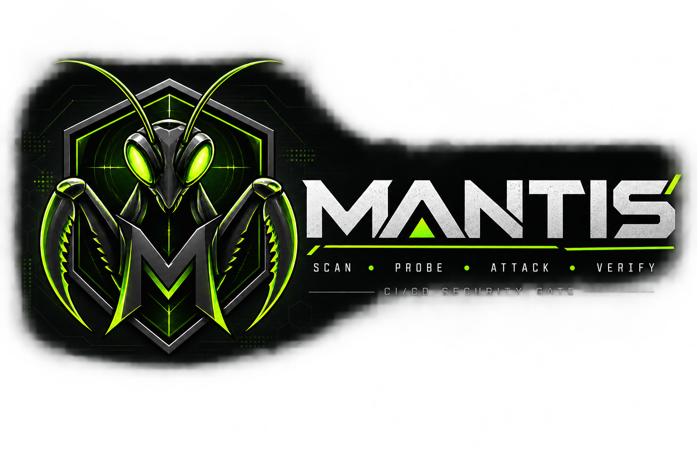

<p align="center">
  
</p>

# Mantis

A template-driven DAST and application validation tool, built to run as a
step in a deployment pipeline rather than as a standalone scanner someone
kicks off by hand.

## What problem it solves

After every deploy, there are really two questions worth asking: did the
app actually come up working, and did this deploy introduce anything
security-relevant. Most pipelines answer neither in a structured way - a
smoke check here, a scanner report nobody opens there, no single gate that
actually blocks a bad deploy.

Mantis answers both with one command and one exit code. Smoke tests answer
"does it work." Templates, a crawler with passive checks, and OpenAPI-driven
API tests answer "is it secure." Detection is deterministic on purpose - no
model in the loop deciding whether something's a finding. A template either
matches or it doesn't, so a given target and a given template set always
produce the same result.

## Features

### Template engine

YAML templates in the Nuclei style: request chaining, five matcher types
(status/word/regex/json/dsl), three extractor types (json/regex/header),
and a small DSL for matcher/assertion expressions - parsed with Go's own
`go/parser` instead of a third-party expression library. 22 starter
templates ship in `templates-community/` (see `mantis templates list`).

### DAST

A crawler with inline passive checks (missing security headers, insecure
cookies, CORS misconfiguration, server version disclosure, directory
listing) running against every page it fetches, followed by active testing:
the loaded template set against the target root, plus per-parameter fuzzing
against every discovered query parameter and form field (`internal/attacks`)
- SQL injection, reflected XSS, path traversal, server-side template
injection, and OS command injection, each with 2-3 payloads picked for low
false-positive signal (error strings, literal reflection, an arithmetic
result unlikely to appear by accident, an echo marker) rather than
blind/timing-based detection. Query parameters are always safe to fuzz
(GET only); form fields using anything other than GET only get fuzzed when
the environment policy allows destructive testing. Bounded by the same
`max_requests` the crawler uses, so it can't run away on a large site.

### Smoke testing

YAML workflows that chain HTTP requests through extracted variables, with
JSONPath and DSL assertions, best-effort cleanup requests, and dependencies
between workflows.

### API testing

Point it at an OpenAPI 3 (or Swagger 2) spec and it generates checks for
missing authentication, undeclared HTTP method acceptance, broken object
level authorization, and sensitive-looking keys in response bodies.

BOLA gets two modes depending on what auth is configured. With a single
identity it's a heuristic: two different sample IDs both returning 200
under the same credentials, flagged at reduced confidence since it doesn't
actually prove anything. With two or more `identities` configured in
`environments.yaml` (each with a known owned resource id via `owns`), it's
a real check: identity A requesting a resource identity B is known to own,
and getting a 200 back, is a confirmed finding at full confidence - not a
guess, because the test fixtures tell Mantis exactly who owns what.

### Environment-aware policy

Environments resolve to a security level - `aggressive`, `standard`, or
`passive` - that controls what's actually allowed to run:

| Level      | Smoke | Passive DAST | Active DAST | Destructive |
| ---------- | :---: | :-----------: | :----------: | :---------: |
| aggressive |  Yes  |      Yes      |     Yes      |     Yes     |
| standard   |  Yes  |      Yes      |     Yes      |      No     |
| passive    |  Yes  |      Yes      |      No      |      No     |

Any environment name that isn't found, or has no recognized
`security_level`, resolves to `passive` - the safest policy. A typo in an
environment name should never grant more access than intended.

### Security gate

`mantis validate` runs smoke + passive DAST + active DAST + optional API
tests according to the target environment's policy, then makes a single
pass/fail decision with a real exit code. Before running any checks, every
command does a baseline reachability request first - a target that's
completely unreachable fails loudly with an operational error instead of
silently running zero checks and reporting a clean pass.

### Reporting

Console, JSON, SARIF 2.1.0, JUnit XML, HTML, and a native Azure DevOps
format that streams `##vso[...]` logging commands directly to a pipeline's
console - findings show up as real entries in the Issues panel with no
marketplace extension needed. `--report` takes a comma-separated list
(`junit,sarif,html,azdo`) so one scan produces every output you need.

## Architecture

```
cmd/mantis/          CLI entry point and command wiring
internal/
  httpclient/         the one HTTP execution path - scope, rate limits,
                       redirects, response size caps, secret redaction
  templates/           YAML parsing, matchers, extractors, request chaining
  dsl/                 the matcher/assertion expression language
  jsonpath/             minimal JSONPath used by matchers and extractors
  dast/                crawler + passive checks + active scan orchestration
  attacks/              per-parameter fuzzing (sqli/xss/path-traversal/ssti/cmdi)
  smoke/               smoke workflow parsing and execution
  api/                 OpenAPI reader + generated API security checks
  environments/        environment profiles and security-level policy
  gate/                 the pass/fail decision
  findings/             the shared finding type
  reporters/            console/json/sarif/junit/html/azdo output
templates-community/  starter security templates
smoke/                example smoke workflow
ci/                   example pipeline integration (Azure Pipelines)
```

Two external dependencies (`gopkg.in/yaml.v3`, `golang.org/x/net/html`).
Everything else - the HTTP client, the matcher/extractor engine, the DSL,
the OpenAPI reader, SARIF/JUnit output - is hand-rolled to keep this light
rather than dragging in a pile of transitive dependencies for what are,
individually, fairly small problems.

## Requirements

- Go 1.23+

## Quick start

```bash
git clone https://github.com/bogdanticu88/Mantis.git
cd Mantis
go build -o mantis ./cmd/mantis

# template-driven scan against a target
./mantis scan https://example.com --fail-on high

# discovery + passive + active DAST
./mantis dast https://example.com --fail-on high

# smoke test workflows
./mantis smoke --target https://example.com --workflows-dir smoke

# OpenAPI-driven API security tests
./mantis api scan --target https://example.com --openapi openapi.yaml

# the full CI/CD gate, per environment policy
./mantis validate --environment test --environments-file environments.yaml \
  --report junit,sarif,html --output-dir ./reports
```

See `environments.example.yaml` and `openapi.example.yaml` for config
examples, and `ci/azure-pipelines.example.yml` for a complete pipeline step
block (build, run the gate, publish JUnit results and SARIF/HTML
artifacts).

Every scan/dast/smoke/api/validate command accepts `--environment`,
`--environments-file`, `--fail-on critical|high|medium|low|any`,
`--report` (comma-separated), `--output`/`--output-dir`,
`--insecure-skip-verify`, `--timeout`. Flags can go before or after the
positional target.

## Releases and Docker

Tagged releases (`vX.Y.Z`) are built by `.github/workflows/release.yml`
via [goreleaser](https://goreleaser.com): binaries for
linux/darwin/windows on amd64/arm64, each archive bundling the binary,
`templates-community/`, `README.md` and `LICENSE`, plus a `checksums.txt`.
`mantis version` reports the real tag, commit and build date - injected
via `-ldflags`, the same mechanism goreleaser uses. The `.goreleaser.yml`
config and the Dockerfile were both validated against the actual tools
locally (a `goreleaser release --snapshot` run and a real `docker build`),
not just written to spec.

A Docker image is published to `ghcr.io/bogdanticu88/mantis` on every
tagged release (linux/amd64 + linux/arm64), built from a distroless base
with `templates-community/` baked in at `/app`, so the default relative
paths work with no extra mounting:

```bash
docker run --rm ghcr.io/bogdanticu88/mantis:latest scan https://example.com --fail-on high
```

For an environments file or custom templates, mount them in and point the
flags at the mounted path:

```bash
docker run --rm -v "$(pwd)":/data ghcr.io/bogdanticu88/mantis:latest \
  validate --environment test --environments-file /data/environments.yaml
```

## Development setup

```bash
make build      # go build -o mantis ./cmd/mantis
make test       # go test ./... -v
make vet        # go vet ./...
make fmt        # gofmt -l . (lists unformatted files)
make templates  # build, then validate every template in templates-community/
make clean      # remove built binaries and stray report files
```

Every package has unit test coverage, including `cmd/mantis` itself (flag
parsing, exit codes, command wiring - `main()` is split into a testable
`dispatch()`/`exitCodeFor()` so tests don't need to shell out to a
subprocess), the DAST crawler (scope enforcement, depth/request limits,
form extraction), the fuzzing engine, and the API package's generated
checks (missing-auth, method-abuse, both BOLA modes, sensitive-data
detection).

## Configuration reference

**`environments.yaml`** maps environment names to a base URL, a
`security_level`, and optional authentication (`bearer`, `basic`, or
`oauth2` client-credentials). An environment can also declare `identities`
- a second set of credentials plus an `owns` map of resource ids, which is
what turns the API BOLA check from a heuristic into a real one (see
`environments.example.yaml` for a worked example):

```yaml
application:
  name: Payments API

environments:
  dev:
    base_url: https://dev.example.com
    security_level: aggressive
  production:
    base_url: https://api.example.com
    security_level: passive
    authentication:
      type: bearer
      token: ${MANTIS_TOKEN}
```

**Templates** (`templates-community/*.yaml`): `id`, `info`
(name/severity/tags/description/remediation/cwe/owasp), optional
`variables`, and a `requests` chain. Each request has `method`, `path`,
optional `headers`/`body`, `matchers`, and `extractors`. Matchers support
`status`, `word`, `regex`, `json` (`$.a.b[0]` style paths), and `dsl`
(`status_code == 200 && contains(body, 'foo')` - functions: `contains`,
`starts_with`, `ends_with`, `len`, `regex`, `to_lower`, `to_upper`,
`header(name)`). Variables use `${name}` or `{{name}}` placeholders in
path/headers/body.

**Smoke workflows** (`smoke/*.yaml`): an ordered list of `steps`, each with
a `request`, `assertions` (`status`, `path` + `exists`/`equals`, or a raw
`dsl` expression), and optional `extract`. `cleanup` requests always run
last, best-effort. Workflows can `depends_on` other workflows by id.

Every finding carries the request/response exchange(s) that produced it.
Sensitive headers and any resolved secret values are redacted before a
finding is ever constructed (see `internal/httpclient/redact.go`) - secrets
never reach a report or log line.

## Roadmap

### Near-term

- Environment drift detection - compare the same finding across
  dev/test/acc/prod and flag regressions introduced between environments
- Native GitHub Actions annotations / check runs (beyond SARIF upload)
- More fuzzing payloads/classes (SSRF-via-parameter, XXE, NoSQL injection)
  once the current 5-class set has proven itself low-noise in practice

### Later

- GraphQL support past a raw introspection template
- WebSocket testing, browser-based/JS-driven crawling
- Native GitHub/GitLab PR annotations (currently file-based SARIF/JUnit
  only, alongside the native Azure DevOps reporter)

## License

MIT - see [LICENSE](LICENSE).
